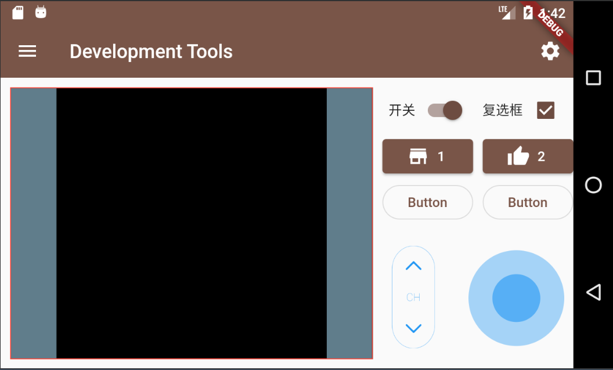

# Development Tools

* 一个用 flutter 开发的工具，目前是这样
  
  

## 开发目的

1. 受到疫情的影响，被迫需要远程办公；但是硬件又不在身边，需要同事帮忙做一些操作，非常的不方便。

2. 左侧的区域是用来接受流媒体，例如摄像头，可以观测到硬件的情况

3. 右侧是操控台，可以下发一些指令给机器

4. 加了遥感是因为，我希望他可以有更多的用处，例如有摄像头的小车，可以来前进后退 ，旋转方向，后期用 openvc 还可以做一些更有趣的事情

5. 用 flutter 开发是希望在多个设备上都能运行，而不是单一的设备

## TODO

1. 目前只写了大概的图形界面，具体的硬件操作部分还有待开发

2. 流媒体的处理还没有在真机上跑过，包括卡顿会不会影响操作等情况
